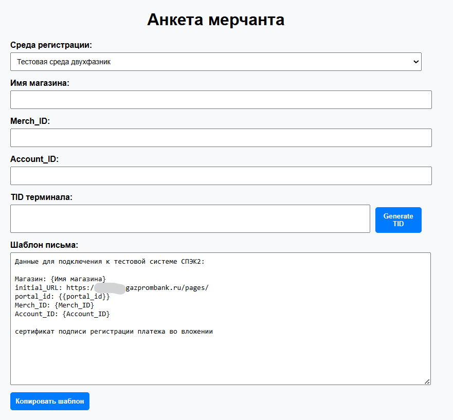

# merchant-onboarding-tools — Инструменты для подключения мерчантов 🧰

## О проекте
Набор HTML-инструментов для автоматизации подключения новых мерчантов к платежному шлюзу Газпромбанка. Созданы для ускорения рутинных задач интеграторов и технической поддержки, стандартизации ответов и уменьшения ошибок при заведении новых магазинов.

Инструменты используются в продакшене и позволяют за пару минут сформировать полный пакет данных для мерчанта.

## 🚀 Состав проекта

### 1️⃣ Анкета мерчанта (`Анкета мерчанта v1_4.html`)
Автоматизация создания анкеты для подключения мерчантов к платежному шлюзу.

**Поддерживаемые среды и схемы:**
- Тестовые среды (СПЭК2)
- Промышленные среды (3 инстанса)
- Различные схемы подключения:
  - Двухфазная CPA схема
  - Схема с пропуском CPA
  - Схема без CPA (однофазная)

**Возможности:**
- Автоматическая генерация TID (Terminal ID)
- Динамические шаблоны под каждую среду
- Формирование полного пакета данных (initial_URL/host, portal_id, Merch_ID, Account_ID)
- Готовый текст для отправки клиенту

### 2️⃣ Доступ в ЛК (`ЛК v1_1.html`)
Управление доступом в Личный Кабинет мерчанта.

**Возможности:**
- Генерация учетных данных:
  - Логин мерчанта
  - Пароль для входа в ЛК
  - Пароль для API мерчанта
- Поддержка всех сред:
  - Тестовая среда СПЭК2
  - Промышленная среда СПЭК2
  - Промышленная среда СПЭК3
- Генерация готового письма с данными доступа
- Автоматическая копия в буфер обмена

## 🛠 Технологии
- **HTML5/CSS3** — современный адаптивный интерфейс
- **Vanilla JavaScript** — без зависимостей, быстрая работа
- **Flexbox** — удобное расположение элементов
- **DOM API** — динамическое обновление контента
- **Clipboard API** — копирование в буфер обмена

## 📸 Скриншоты
*(Сюда можно добавить скриншоты интерфейса анкеты и формы доступа)*

## ⚙️ Использование
1. Открыть нужный HTML-файл в браузере
2. Выбрать среду регистрации
3. Заполнить или сгенерировать необходимые данные
4. Скопировать готовый шаблон письма (кнопка "Копировать шаблон")
5. Отправить клиенту

## 🏆 Ключевые достижения
- ✅ Автоматизация рутинных задач при подключении новых мерчантов
- ✅ Стандартизация ответов технической поддержки
- ✅ Снижение ошибок при заведении магазинов
- ✅ Единый формат всех анкет и писем
- ✅ Ускорение процесса подключения при интеграции новых клиентов

## 💡 Почему этот проект важен
- **Понимание платежных экосистем** — глубокие знания интеграции
- **Автоматизация процессов** — умение оптимизировать рутину
- **Проактивный подход** — создание инструментов для команды
- **Документирование** — важность четких инструкций
- **User Experience** — удобство для конечных пользователей

## 🔗 Статус
- ✅ **Используется в Production**
- 🎯 **Целевая аудитория:** Интеграторы, техническая поддержка
- ⚙️ **Применение:** Внутренние инструменты для работы с платежным шлюзом

- ## Скриншоты

